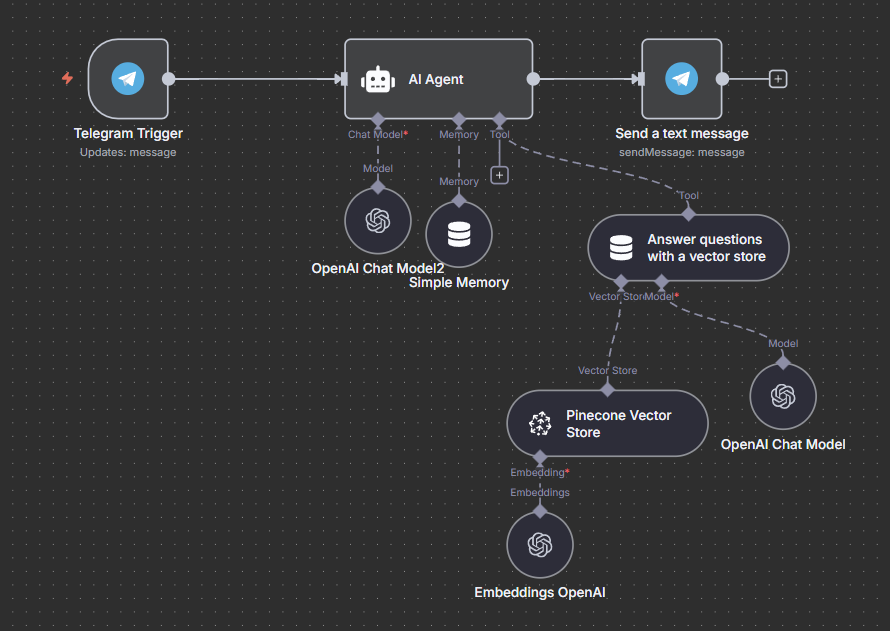

# 📚 Afeka College RAG Bot

This project, which **🏆 won 1st place at Afeka College’s Hackathon (2025)**, is a **Retrieval-Augmented Generation (RAG) chatbot** built with [n8n](https://n8n.io/) and **OpenAI Chat Models**.  
It is designed to **answer questions about Afeka College** by combining structured data (PDF files, WhatsApp messages) and unstructured knowledge scraped from the Afeka website.  
The bot communicates with users through **Telegram** (primary interface) and has also been tested with **WhatsApp message datasets**.

---

## 🚀 Features
- **RAG architecture**: Uses OpenAI embeddings with a Pinecone vector database to retrieve and ground responses.
- **Multi-source ingestion**:  
  - Workflow for **PDF files** (official documents, course guides).  
  - Workflow for **WhatsApp JSON exports** (student group discussions, FAQs).  
- **Messaging integration**:  
  - **Telegram bot** for interactive question answering.  
  - Future extension for WhatsApp live messaging.  
- **Preprocessing notebook**: Cleans and normalizes WhatsApp chat logs into a format suitable for ingestion.
- **Contextual memory**: Maintains short-term conversational context with buffer memory.
- **Visual workflows**: Included `.png` diagrams for each workflow.

---

## 🎯 Use Cases
- Students get instant answers about academic regulations, courses, and procedures.
- Academic staff saves time by focusing on more complex student needs.
- College community benefits from faster and more accessible information.

---

- ## ⚙️ Workflows Overview

### 1. Agent Workflow (Telegram RAG Bot)
- **Trigger**: Telegram messages  
- **Steps**:  
  - Parses incoming text  
  - Queries Pinecone vector DB  
  - Sends response through OpenAI Chat (`gpt-4.1-mini`)  
  - Replies back to the user via Telegram  

---

### 2. Preprocessing PDF Files
- Downloads PDF files  
- Splits content into chunks  
- Creates embeddings with OpenAI  
- Stores vectors in Pinecone  

---

### 3. Preprocessing WhatsApp JSON Files
- Extracts text from exported WhatsApp chats  
- Cleans emojis, metadata, and non-relevant text  
- Splits conversations into chunks  
- Embeds and stores in Pinecone  

---

### 4. Notebook: WhatsApp Preprocessing
- Converts WhatsApp JSON exports into a clean dataset  
- Handles multi-user dialogue, timestamps, and metadata  
- Outputs structured JSON ready for ingestion  
- Acts as an offline pipeline for experimentation and improvements  

---

## 🛠️ Tech Stack
- **n8n** – workflow automation platform  
- **OpenAI GPT-4.1-mini** – chat model for reasoning and generation  
- **Pinecone** – vector database for embeddings  
- **Telegram API** – chatbot messaging interface  
- **Google Drive API** – used for pulling documents in workflows  
- **Python + Jupyter Notebook** – preprocessing pipeline for WhatsApp data

---
## 🏆 Achievement
This project received **1st place out of 14 teams at Afeka College Hackathon (2025)**.
